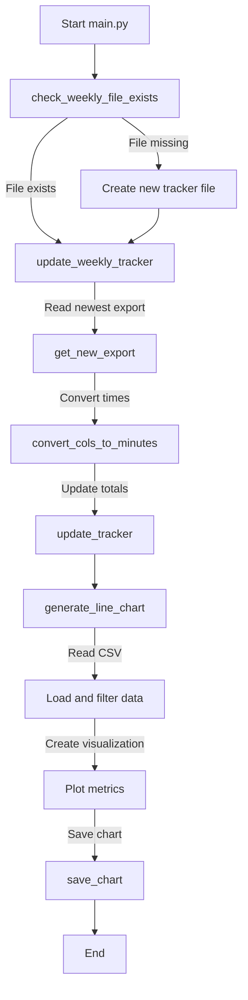

# PAIC Python Starter

## Setup

- `cp .env.sample .env`
  - Update with your keys
- `uv sync`
- Start AI Coding!

## Running the Program

To run the main program:
```bash
uv run python main.py
```

This will:
1. Check and create the weekly tracker file if needed
2. Update the tracker with new export data
3. Generate a line chart visualization



## Running Tests

To run all tests:
```bash
uv run pytest tests/
```

This will execute all test files in the `tests/` directory.

## Aider

- `cp .template.aider.conf.yml .aider.conf.yml`
  - Update to fit your needs

## PAIC tooling

### Specs

- `aider`
- `/editor`
- paste in your spec from `specs/`

### Architect
- `aider --o1-preview --architect --editor-model claude-3-5-sonnet-2024-10-22`
  - add beginning context files
  - copy and paste spec into aider chat

### ADWs 

- `uv run python adw/adw_bump_version.template.py`
  - use this as a template for your own ADWs
  - review this before you use it

### Director

- `uv run python director.py --config spec/*.yaml`
  - use the `director_template.example.yaml` as a template for director configs
